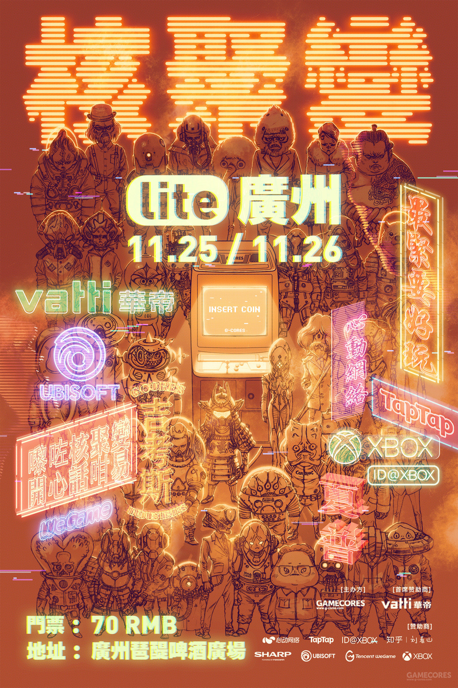
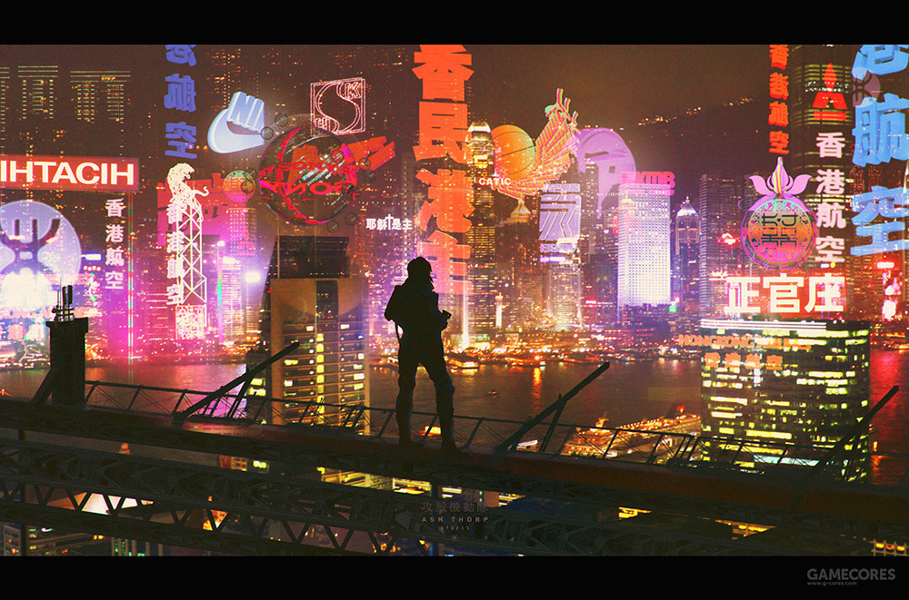
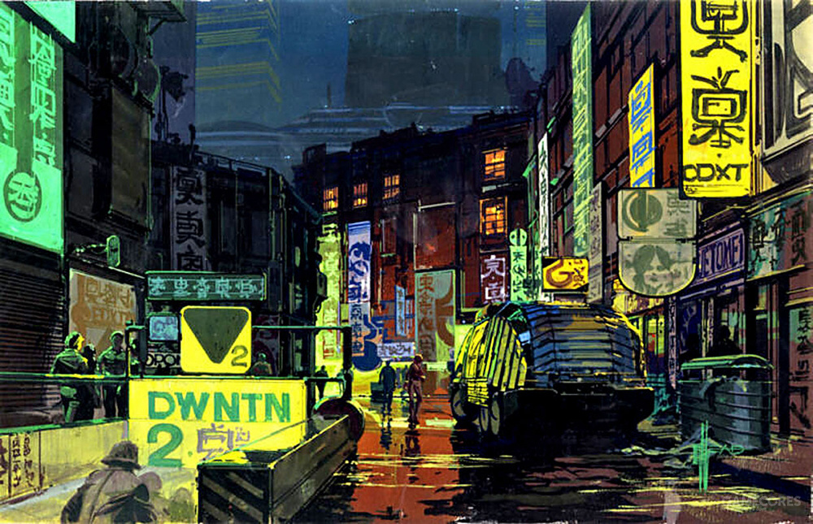

# 主题风格

赛博朋克

# 元素

网络黑客

神秘 - 科技感 - 超前机械

服装 - 科技感 - 机能性

恶劣天气

控制论 - 人工智能

大型企业

基因工程

毒品 - 生化

计算机恐怖主义

网络数字空间 - 虚拟空间

贫民窟 - 阴郁美学 - 荒凉 - 距离感

大型都市 - 繁华 - 拥挤 - 霓虹灯（闪烁） - 金属感 - 潮湿 - 下水道 - 管道

故障艺术

义体化

光影迷离

# 颜色

环境 - 黑

霓虹灯 - 彩虹

网络 - 黑绿

下水道 - 蓝 - 灰

人工智能 - 蓝 - 青

电路电子 - 蓝 - 黄

## 机能与颜色

防护 - 黄

警示

掩蔽 - 隐身 - 迷彩

卫生 - 高明度 - 白色

抗污 - 明度低 - 纯度低 - 深色

生理调节 - 暖色

防水/耐热/防紫外线/多功能易调节机械

易于拆卸重组/伸缩

# 参考

